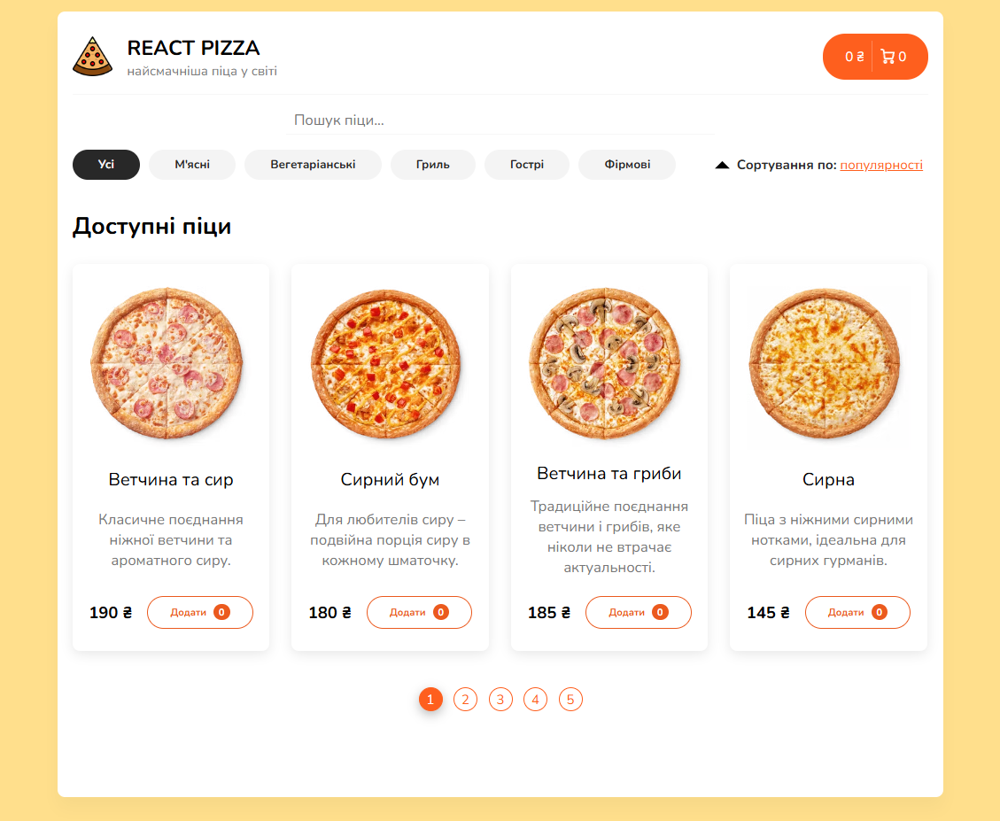

# React Pizza Project

## Description

A small online shop for ordering pizzas, created using React. The application includes a pizza catalogue with the ability to select, add items to cart and place an order. The project demonstrates working with dynamic data, state management and user interaction through a user-friendly interface.

## Technologies that have been used

- HTML5
- CSS3
- SASS
- mockAPI
- JAVASCRIPT (ES6+)
- TYPESCRIPT
- REACT
- REST API
- REDUX-TOOLKIT
- GIT

## Instructions for working with the project

1. Cloning a repository. You need to write `git clone https://github.com/boikoua/react_pizza` in terminal.

2. Go to the project folder `cd react_pizza`.

3. Check the node version. The version of node should be `v20.x.x`. To do this, type the command `node -v` in the terminal.

4. Install dependencies. To do this, enter the `npm install` command.

5. Run the project. To do this, enter the `npm start` command.
   After that the project will be available to you at `http://localhost:3000`.

## View project

> Link to the project
> [DEMO LINK](https://boikoua.github.io/react_pizza).

## Preview

